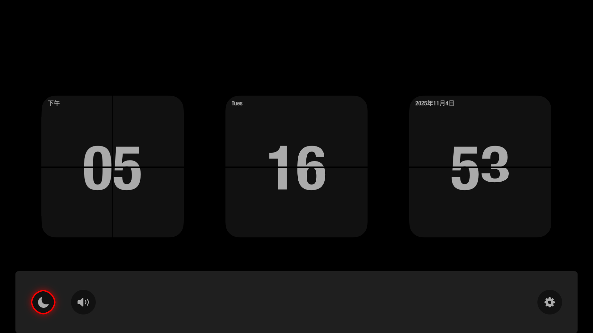
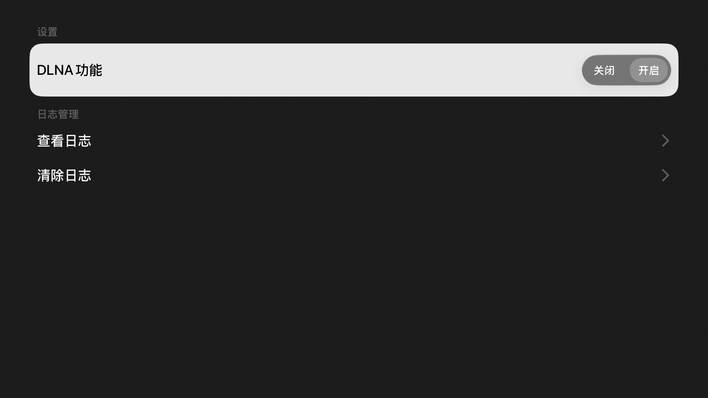
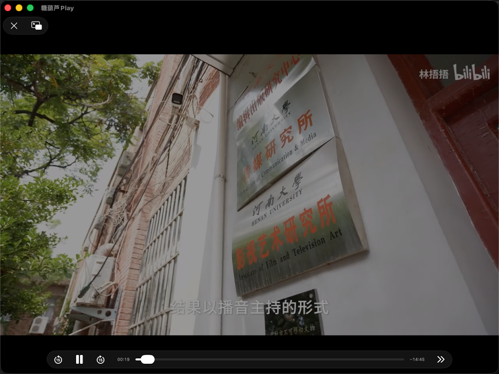

# 糖葫芦播放器

  

appletv的浏览器   testflight地址 [https://testflight.apple.com/join/QWne6G6V ]() 
目前自己一直在用appletv 使用Unplay，使用过程中发现了一些问题，自己尝试做一款同样的类似的的投屏软件，并且解决遇到的一些不合理的问题。

# 首页
默认打开显示时钟页面

  

点击遥控器器上的downArrow按钮，会显示底部菜单

  

# 设置
app的相关设置会显示在这里

  

# DLNA投屏
以b站为例,点击播放页面的投屏按钮后，投屏设备选项后添加上【糖葫芦】的选项

  

  

# 后续开发计划
1. 增加更多始终的时钟样式
2. 设置页面完善，增加更多配置选项
3. 投屏增加B站的投屏，目前使用的DLNA标准投屏，目前已知B站的协议是公开的，网上有成熟的示例
4. 增加不同的播放器选项，目前只支持系统默认提供的AVPlayer

### Telegram Group
 - https://t.me/appletvbilibilidemo

### Links

- [debugly/fsplayer](https://github.com/debugly/fsplayer)
- [ikishorek/TVVLCKit](https://github.com/ikishorek/TVVLCKit)
- [SnapKit/Masonry](https://github.com/SnapKit/Masonry)
- [jsonmodel/jsonmodel](https://github.com/jsonmodel/jsonmodel)
- [CocoaLumberjack/CocoaLumberjack](https://github.com/CocoaLumberjack/CocoaLumberjack)
- [SDWebImage/SDWebImage](https://github.com/SDWebImage/SDWebImage)
- [zattoo/TvOSSlider](https://github.com/zattoo/TvOSSlider)
-  [lechium/KBBulletinView](https://github.com/lechium/KBBulletinView)
-  [zattoo/TvOSSlider](https://github.com/zattoo/TvOSSlider)
-  [vtourraine/VTAcknowledgementsViewController](https://github.com/vtourraine/VTAcknowledgementsViewController)
-  [AliSoftware/Reusable](https://github.com/AliSoftware/Reusable)
-  [nicklockwood/GZIP](https://github.com/nicklockwood/GZIP)
-  [AliSoftware/Reusable](https://github.com/AliSoftware/Reusable)
-  [robbiehanson/CocoaAsyncSocket](https://github.com/robbiehanson/CocoaAsyncSocket)
-  [SwiftyJSON/SwiftyJSON](https://github.com/SwiftyJSON/SwiftyJSON)
-  [yichengchen/swifter](https://github.com/yichengchen/swifter)
-  [mattt/Ono](https://github.com/mattt/Ono)
-  [yichengchen/ATV-Bilibili-demo](https://github.com/yichengchen/ATV-Bilibili-demo)
-  [steventroughtonsmith/tvOSBrowser](https://github.com/steventroughtonsmith/tvOSBrowser)
