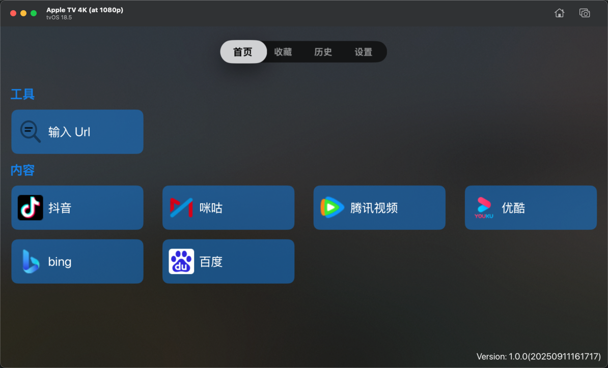

# 糖葫芦浏览器

  

appletv的上使用的浏览器   
目前自己一直在用appletv 上使用起飞了浏览器，但是发现有些操作存在一些问题，自己参考后做了一些操作上的优化。
因为政策的原因，这个估计只能闭源。 
testflight地址  
https://testflight.apple.com/join/QWne6G6V
 部分操作说明 
1:双击【播放/暂停】可显示包含更多选项的高级菜单; 
2:长按【播放/暂停】可以直接打开播放器全屏播放视频; 
3:点击【播放/暂停】可以控制视频的播放暂停; 
4:点击【菜单】按钮可返回，或在根页面上退出; 
5:点击【左/右】按钮可以控制视频的快进，向左向右滑动触控区域可以控制视频的快进（需要到设置中打开）; 
6:点击【上/下】按钮可以控制页面往下滚动，部分网页可以控制视频的上翻/下翻操作; 
7:双击触摸区域，可以实现光标模式/滚动模式/触摸模式/触摸模式/拖动模式的切换; 
【点击模式】光标显示在页面上，点击触摸区域后 实现页面的点击事件，部分页面采用的是iframe内嵌页面，可以长按iframe区域，新开窗口打开iframe; 
【滚动模式】通过触摸区域的上下滑动，点击上下按钮，实现页面的滚动; 
【触摸模式】触摸区域点击使用mousedown、mouseend实现点击，页面上的按钮需要使用点击模式点不中，有些验证码页面可以尝试使用，滚动实现mousemove，有些需要滑动鼠标才能显示的页面可以尝试使用; 
【拖动模式】长按触摸区域选择需要拖动的元素，实现元素的拖动; 
8:注意：如果当前网页正在播放视频，【播放/暂停】会被系统拦截，点击第一下会暂停视频，长按、双击操作都需要再次操作。 

# 首页
这里需要注意，首页有可能是个时钟，是为了避免apple审核，当时首页显示时钟的时候需要双击播放按钮，就会出现当前首页
目前只有一个工具，输入url，会跳转到对应的网页上

  

# 收藏
收藏的页面会显示到这里
# 历史
浏览历史记录会显示到这里
# 设置
app的相关设置会显示在这里

  

# 浏览器
以抖音为例子,首页进入抖音，可以通过触摸板控制鼠标位置，双击播放按钮，可以弹出高级选项，上下按钮可以上一个、下一个视频。

  

如果当前页面正在播放视频，可以通过左右按键显示播放进度，并且可以调整进度，进度栏显示在页面的顶部。

  

  

### releases

- [releases.md](https://github.com/never88gone/HSBTVBrowser/blob/main/releases.md?plain=1)

### Telegram Group
-  [https://t.me/tanghulutvos](https://t.me/tanghulutvos)

 

  
### Links

- [debugly/fsplayer](https://github.com/debugly/fsplayer)
- [ikishorek/TVVLCKit](https://github.com/ikishorek/TVVLCKit)
- [SnapKit/Masonry](https://github.com/SnapKit/Masonry)
- [jsonmodel/jsonmodel](https://github.com/jsonmodel/jsonmodel)
- [CocoaLumberjack/CocoaLumberjack](https://github.com/CocoaLumberjack/CocoaLumberjack)
- [SDWebImage/SDWebImage](https://github.com/SDWebImage/SDWebImage)
- [zattoo/TvOSSlider](https://github.com/zattoo/TvOSSlider)
-  [lechium/KBBulletinView](https://github.com/lechium/KBBulletinView)
-  [vtourraine/VTAcknowledgementsViewController](https://github.com/vtourraine/VTAcknowledgementsViewController)
-  [AliSoftware/Reusable](https://github.com/AliSoftware/Reusable)
-  [nicklockwood/GZIP](https://github.com/nicklockwood/GZIP)
-  [AliSoftware/Reusable](https://github.com/AliSoftware/Reusable)
-  [robbiehanson/CocoaAsyncSocket](https://github.com/robbiehanson/CocoaAsyncSocket)
-  [SwiftyJSON/SwiftyJSON](https://github.com/SwiftyJSON/SwiftyJSON)
-  [yichengchen/swifter](https://github.com/yichengchen/swifter)
-  [mattt/Ono](https://github.com/mattt/Ono)
-  [yichengchen/ATV-Bilibili-demo](https://github.com/yichengchen/ATV-Bilibili-demo)
-  [steventroughtonsmith/tvOSBrowser](https://github.com/steventroughtonsmith/tvOSBrowser)
