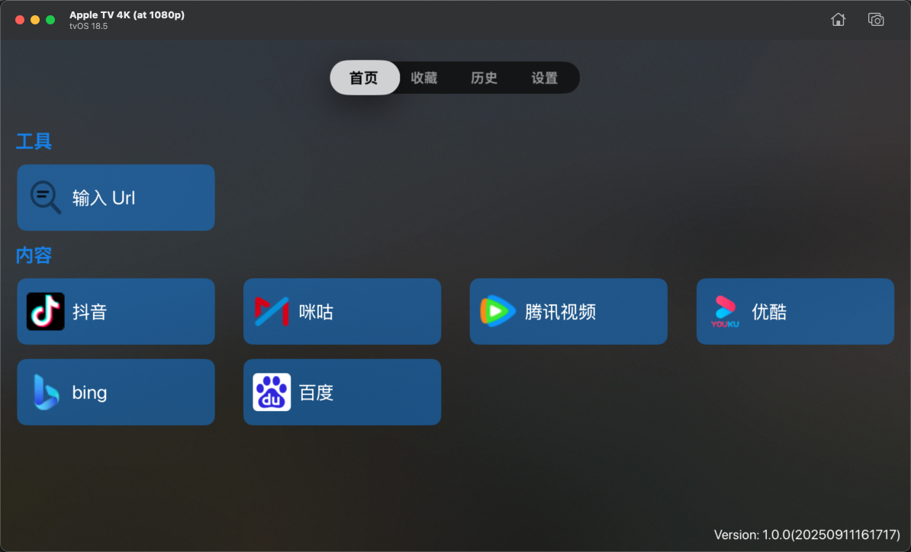
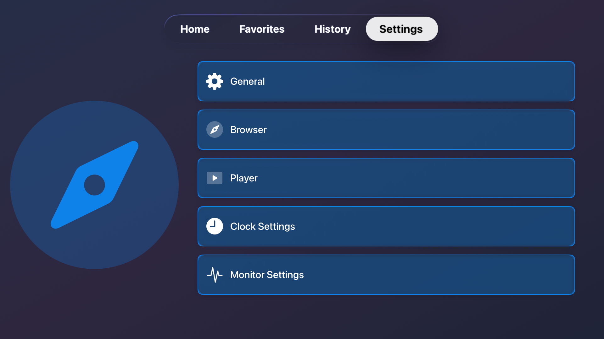
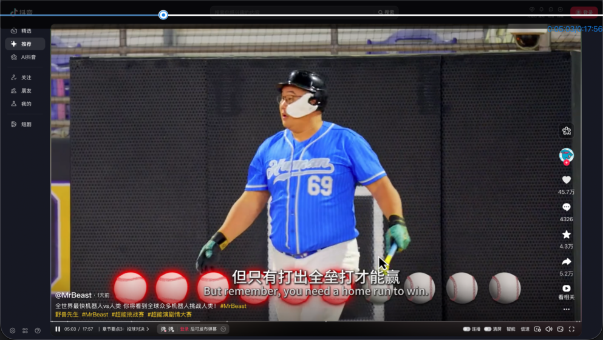
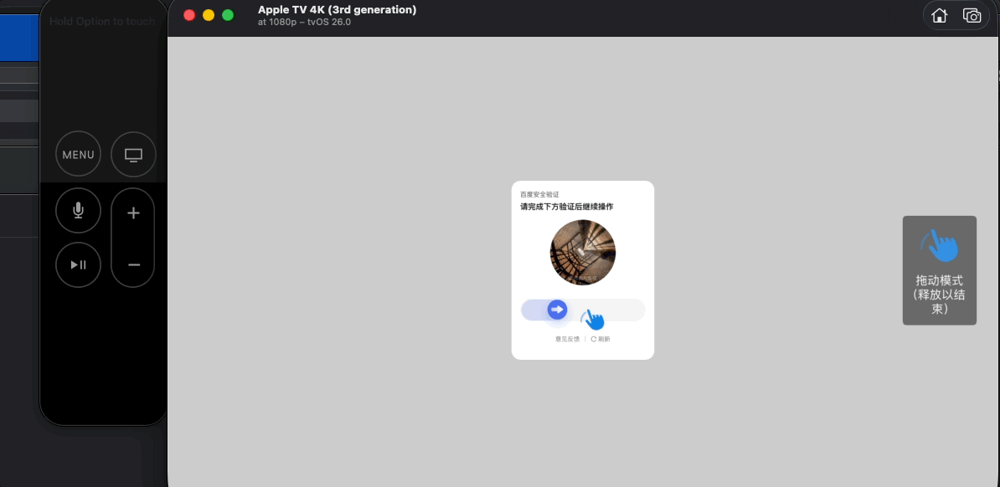
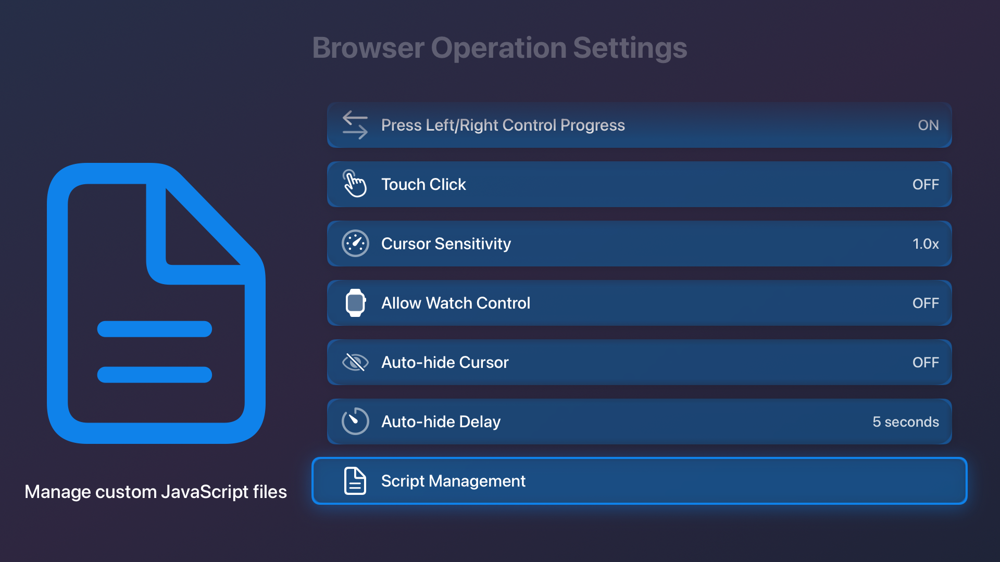
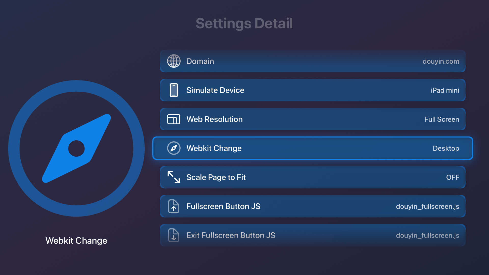

# 糖葫芦ブラウザ (Tanghulu Browser)

[简体中文](README_ZH.md) | [English](README.md) | [Türkçe](README_TR.md) | [Français](README_FR.md) | **日本語** | [한국어](README_KO.md) | [Español](README_ES.md)

  

---

## 🌟 主な特徴と紹介

**糖葫芦ブラウザ (Tanghulu Browser)** は、**Apple TV (tvOS) 向けにディープにカスタマイズされた多機能ウェブブラウザおよび動画再生ツール**です。大画面テレビでのブラウジング体験を再定義し、Apple TV リモコンに最適化された直感的でスムーズな操作性を提供します。

* 📺 **大画面での快適なストリーミング**：Apple TV 上で **TikTok、Douyin (抖音)、Tencent Video (騰訊視頻)、Youku (優酷)、Bilibili** などの主要な動画プラットフォームを直接快適に楽しめます。
* 🖱️ **リモコンに最適化されたジェスチャー**：**クリック、スクロール、タッチ、ドラッグ** の 4 つの専用コントロールモードをサポートし、テレビ用ブラウザでの精度の低い操作問題を完璧に解決します。
* ⚙️ **高度なカスタムスクリプト**：強力な **JavaScript スクリプトマネージャー** を内蔵。ローカルから JS ファイルをアップロードして実行することで、自動ログインやカスタムフルスクリーンなどを簡単に実現できます。
* 🧭 **未来の体験を探索**：大画面でのスマートな音声コントロール、リアルタイムの AI 動画字幕翻訳、独自の WebKit カーネル移植など、複数の最先端技術の開発を積極的に進めています！

> 💡 **もしこのプロジェクトがお役に立ちましたら、右上の Star 🌟 ボタンをクリックしてサポートをお願いします！皆様の応援が継続的な開発の最大の原動力です！**
> 
> 📌 Appleのポリシー制限により、本プロジェクトはクローズドソースのままとなる可能性が高いです。ベータ版や最新情報については、[Telegram グループ](https://t.me/tanghulutvos) にご参加ください！

---

## 🗺️ プロジェクト開発ロードマップ (Roadmap)

現在、大言語モデル (LLM) のディープな統合や、デバイスローカルでの AI リモコン連携など、本プロジェクトの次世代機能を急速に拡張しています。今後の詳細な予定については、[**Roadmap / 開発ロードマップ**](roadmap.md) をぜひご覧ください！

---

## TestFlight URL

<https://testflight.apple.com/join/QWne6G6V>

## 操作方法

1. **【再生/一時停止】**をダブルクリックすると、詳細メニューが表示されます
2. **【再生/一時停止】**を長押しすると、プレーヤーを直接フルスクリーンで開きます
3. **【再生/一時停止】**をクリックすると、ビデオの再生/一時停止をコントロールします
4. **【メニュー】**をクリックすると前に戻る、またはルートページで終了します
5. **【左右方向】**をクリックしてビデオの早送り/巻き戻し、またはタッチエリアで左右にスワイプします（設定で有効にする必要があります）
6. **【上下方向】**をクリックしてページをスクロール、または一部のWebサイトで前/次のビデオに移動します
7. タッチ領域をダブルクリックして、カーソルモード / スクロールモード / タッチモード / ドラッグモード を切り替えます：
   - **クリックモード**: カーソルがページに表示され、ページをクリックできます。iframeのページでは、iframe領域を長押しして新しいウィンドウで開けます
   - **スクロールモード**: 上下スワイプや上下ボタンを使用してページをスクロールします
   - **タッチモード**: ボタンなどがクリックできない場合に使います。マウスダウン/マウスアップによるクリックが可能です
   - **ドラッグモード**: 長押しでドラッグする要素を選択し、要素を移動させます
8. **注意**: 動画再生中は【再生/一時停止】ボタンがシステムに乗っ取られます。最初のクリックで動画を一時停止させる必要があります。

## ホーム

注意：Appleの審査を回避するため、ホームページに時計が表示されることがあります。時計が表示された場合、再生ボタンをダブルクリックすると実際のホームページにアクセスできます。

現在は入力したURLのページに移動する機能のみがあります。

  

## お気に入り

ブックマークされたページがここに表示されます。

## 履歴

閲覧履歴がここに表示されます。

## 設定

アプリ関連の設定が表示されます。

  

## ブラウザ機能

Douyinを例に挙げます。ホームページからDouyinにアクセスし、トラックパッドを使ってマウスの位置をコントロールできます。再生ボタンをダブルクリックすると高度なメニューが表示されます。上下ボタンで前後のビデオへ移動可能です。

  

動画再生中は、左右のボタンで再生進捗を表示・調整できます。プログレスバーはページ上部に表示されます。

  

  

## カスタム機能

提供するローカルのJavaScriptファイルをアプリにアップロードして、高度なカスタム機能を実装できます。

### スクリプトマネージャー

独自のJSスクリプトをアップロードし、管理することができます。

  

### サイト設定

Webサイト設定では、以下のタイミングでスクリプトが実行されるように設定できます：

- **カスタムフルスクリーン**: フルスクリーンに入るとき
- **フルスクリーン終了時**: フルスクリーンから出るとき
- **ロード完了後**: ページ読み込み完了時

  

### カスタムボタン

高度なメニューで、クリック時に指定したJSスクリプトを実行するカスタムボタンを追加できます。

  

### スクリプトの自動実行

自動ログインなどの自動操作を実現するスクリプトを作成できます。

  

## 既知の問題

短期的に解決できないバグ：

1. **MSEによるビデオ再生制限**: iQiyi、Douyin Live、MiguビデオなどのMSE（メディアソース拡張機能）を使用するビデオは、システムの制限により再生できません。
2. **Iframe操作制限**: 埋め込まれたiframeのページの一部が動作しない場合があります。
3. **再生制御の競合**: 動画再生時は、再生/一時停止ボタンがシステムにインターセプトされます。

## 重要な注意事項

### メモリ不足問題

ページに「メモリが不足しています」と表示された場合の理由と対処法は次のとおりです。

**理由:**

1. Apple TVのメモリは最新モデルでも4GBと限られています。
2. RAMとVRAMが共有されているため、4KではVRAMが多くのメモリを占有します。
3. tvOS 26の流体ガラス効果は大量のメモリを消費します。
4. デスクトップサイトをシミュレートするとChrome等は非常に多くのメモリを必要とします。

**解決策:**

1. バックグラウンドの他のアプリを終了する
2. デバイスを再起動する
3. 設定でガラスエフェクトをオフにする
4. 新しいApple TVモデルにアップグレードする

## 変更履歴

- [releases.md](https://github.com/never88gone/HSBTVBrowser/blob/main/releases.md?plain=1)

## Telegram グループ

- <https://t.me/tanghulutvos>

  

## 謝辞

- [debugly/fsplayer](https://github.com/debugly/fsplayer)
- [ikishorek/TVVLCKit](https://github.com/ikishorek/TVVLCKit)
- [SnapKit/Masonry](https://github.com/SnapKit/Masonry)
- [jsonmodel/jsonmodel](https://github.com/jsonmodel/jsonmodel)
- [CocoaLumberjack/CocoaLumberjack](https://github.com/CocoaLumberjack/CocoaLumberjack)
- [SDWebImage/SDWebImage](https://github.com/SDWebImage/SDWebImage)
- [zattoo/TvOSSlider](https://github.com/zattoo/TvOSSlider)
- [lechium/KBBulletinView](https://github.com/lechium/KBBulletinView)
- [vtourraine/VTAcknowledgementsViewController](https://github.com/vtourraine/VTAcknowledgementsViewController)
- [AliSoftware/Reusable](https://github.com/AliSoftware/Reusable)
- [nicklockwood/GZIP](https://github.com/nicklockwood/GZIP)
- [robbiehanson/CocoaAsyncSocket](https://github.com/robbiehanson/CocoaAsyncSocket)
- [SwiftyJSON/SwiftyJSON](https://github.com/SwiftyJSON/SwiftyJSON)
- [yichengchen/swifter](https://github.com/yichengchen/swifter)
- [mattt/Ono](https://github.com/mattt/Ono)
- [yichengchen/ATV-Bilibili-demo](https://github.com/yichengchen/ATV-Bilibili-demo)
- [steventroughtonsmith/tvOSBrowser](https://github.com/steventroughtonsmith/tvOSBrowser)
