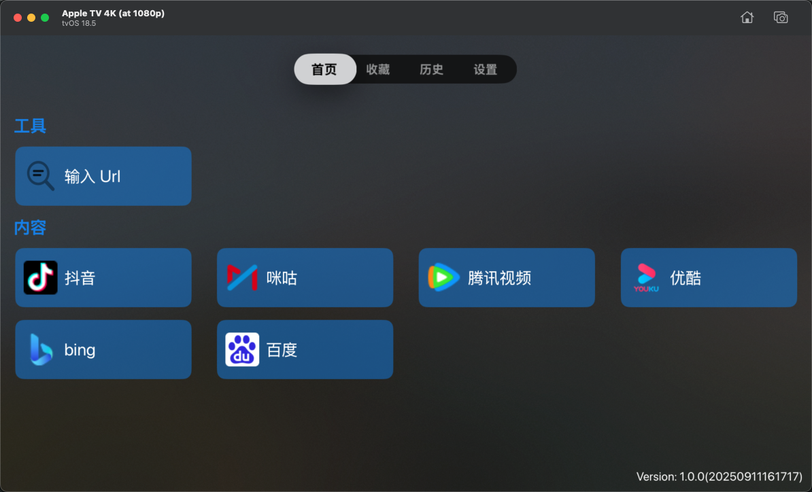
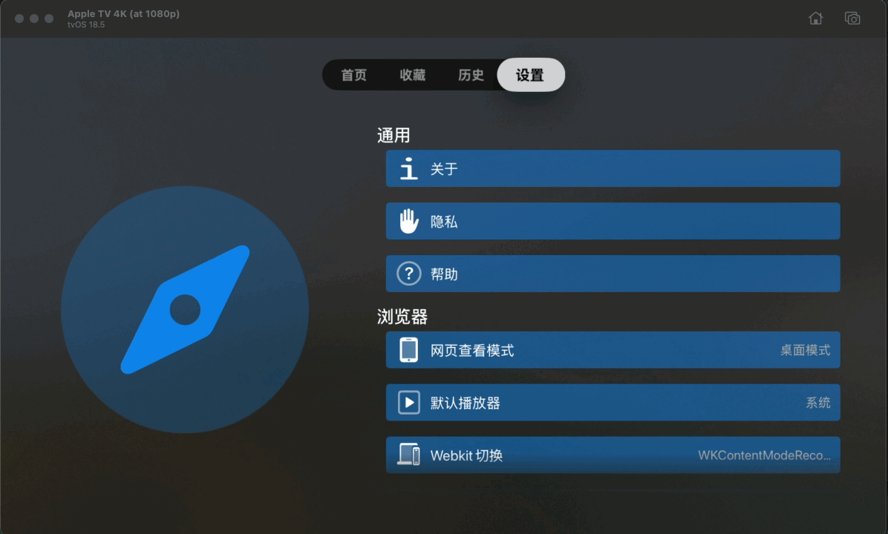

# 糖葫芦浏览器

  

appletv的浏览器   testflight地址 https://testflight.apple.com/join/QWne6G6V
目前自己一直在用appletv 上使用起飞了浏览器，但是发现有些操作存在一些问题，自己参考后做了一些操作上的优化
因为政策的原因，这个估计只能闭源。
上传描述文档，目前没有app开发者账号
正在尝试解决一些问题，后续会提供testflight地址

1:双击【播放/暂停】可显示包含更多选项的高级菜单

2:长按【播放/暂停】可以直接打开播放器屏播放视频

3:点击【播放/暂停】可以控制视频的播放暂停

4:点击【菜单】按钮可返回，或在根页面上退出

5:点击【左/右】按钮可以控制视频的快进

6:点击【上/下】按钮可以控制页面往下滚动，部分网页可以控制视频的上翻/下翻操作

7:双击触摸区域，可以实现光标模式/滚动模式/触摸模式的切换

【光标模式】光标显示在页面上，点击触摸区域后 实现页面的点击事件 
【滚动模式】通过触摸区域的上下滑动，实现页面的滚动 
【触摸模式】触摸区域点击后实现mousedown，滚动实现mousemove，抬起后实现mouseend，有些验证码页面可用，部分页面【光标模式】的点击无效时候可以使用。 

# 首页
目前只有一个工具，输入url，会跳转到对应的网页上

  

# 收藏
收藏的页面会显示到这里
# 历史
浏览历史记录会显示到这里
# 设置
app的相关设置会显示在这里

  

# 浏览器
以抖音为例子,首页进入抖音，可以通过触摸板控制鼠标位置，双击播放按钮，可以弹出高级选项，上下按钮可以上一个、下一个视频。

  

